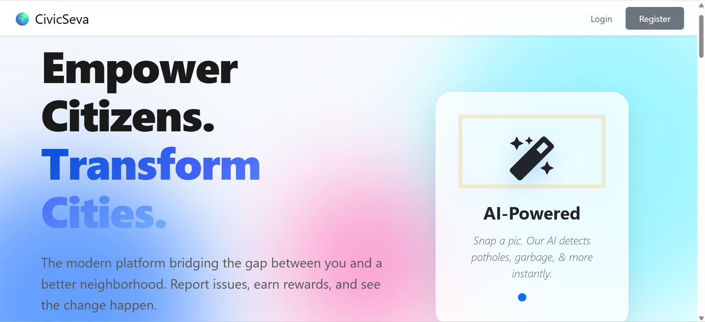

# 🏛️ CivicSeva: AI-Powered Municipal Intelligence & Civic Issue Resolution Platform



[](https://www.djangoproject.com/)
[](https://reactjs.org/)
[](https://www.postgresql.org/)
[](https://www.docker.com/)
[](https://openrouter.ai/)

> **CivicSeva** is an enterprise-grade municipal governance platform that bridges the gap between citizens, department officers, and field workforces. Powered by explainable civic AI, geospatial hotspot clustering, automated duplicate detection, and workload-aware workforce dispatching, CivicSeva transforms civic complaint reporting into streamlined, transparent municipal action.

---

## 🌟 Key Innovations & Features

### 1. 🧠 Explainable Civic Intelligence Priority Engine
Instead of basic "first-come, first-served" queues, CivicSeva calculates a real-time **Priority Score (0–100)** for every issue using transparent, weighted criteria:
* **Severity Weight (40%)**: Critical / High / Medium / Low danger levels.
* **Citizen Consensus (25%)**: Upvotes and duplicate complaint clusters.
* **SLA Urgency (20%)**: Dynamic time-to-breach countdowns.
* **Location Sensitivity (15%)**: Proximity to schools, hospitals, transit hubs, and commercial zones.
* *Provides an explainable algorithmic breakdown checklist for full administrative auditability.*

### 2. 🔍 Real-Time AI Duplicate Detection
* Prevents municipal database clutter by detecting duplicate reports before creation.
* Uses fuzzy alphanumeric address normalization, geospatial proximity, and OpenRouter AI semantic comparison across all active/unresolved issues (`OPEN`, `ASSIGNED`, `IN_PROGRESS`, `PENDING_APPROVAL`).
* Automatically increments the original issue's upvote count and duplicate tracker while notifying the citizen.

### 3. 🏢 Department Officer Command Center
* **Department-Scoped Priority Queue**: Displays the live *"What Should We Fix First?"* queue strictly for the logged-in officer's department (e.g., Roads, Hygiene, Electricity, Water).
* **Live SLA Countdown & Breach Monitoring**: Highlights at-risk tasks with immediate action triggers.
* **Cross-Department Forwarding**: Supports single-click notification workflows for misclassified or multi-department issues.

### 4. 👥 Intelligent Workforce Allocation & Capacity Planning
* **Workload-Aware Task Dispatching**: Calculates individual worker workload using:
  $$\text{Workload Score} = \text{Active Tasks} + (2.5 \times \text{Overdue Tasks})$$
* Prevents worker overload by routing tasks to the employee with the lowest load in the corresponding department.
* Provides full manual assignment override and live department workforce capacity rosters.

### 5. 🛠️ Dedicated Field Worker (Employee) Portal
* Streamlined mobile-responsive interface for field technicians to view assigned tasks, update work statuses (`ASSIGNED` $\rightarrow$ `IN_PROGRESS` $\rightarrow$ `RESOLVED`), and upload before/after photo resolution evidence.

### 6. 🔥 Geospatial Hotspots & Decision Analytics
* Clusters civic issues by geographic coordinates to detect high-density problem zones.
* Interactive Leaflet maps with severity heat indicators, department breakdown analytics, and resolution rate trends.

### 7. 📲 Multi-Channel Notifications
* Integrated with Meta Graph API / WhatsApp for instant report confirmations, high-severity department alerts, and live status updates for citizens.

---

## 🎭 Role-Based Access Control (RBAC)

CivicSeva provides 4 purpose-built portals with distinct privileges:

| Role | Portal / Dashboard | Key Capabilities |
| :--- | :--- | :--- |
| **👑 Administrator** | `/admin/dashboard` | City-wide oversight, department management, cross-department reassignment, municipal analytics. |
| **🛡️ Department Officer** | `/officer/dashboard` | Department priority queue, SLA breach management, workforce auto-allocation & roster monitoring. |
| **👷 Field Employee** | `/employee/dashboard` | Active task management, status updates, photographic evidence upload, field resolution submission. |
| **👤 Citizen** | `/report`, `/my-reports` | Issue reporting with AI description assistant, duplicate detection, upvoting, public tracking feed. |

---

## 👥 Demo Credentials

For testing and demonstration, you can log in with any of the pre-configured accounts:

| Role | Username | Password | Purpose / Scenario |
| :--- | :--- | :--- | :--- |
| **Admin** | `admin` | `admin123` | City Municipal Commissioner |
| **Roads Officer** | `officer_roads` | `officer123` | Roads & Infrastructure Command Center |
| **Hygiene Officer** | `officer_hygiene` | `officer123` | Sanitation & Hygiene Command Center |
| **Field Worker (Optimal)** | `suresh_kumar` | `emp123` | Low workload worker (Recommended by Auto-Assign) |
| **Field Worker (Busy)** | `ravi_sharma` | `emp123` | High workload worker (Demonstrates overload prevention) |
| **Citizen** | `citizen_user` | `citizen123` | Public user for submitting & upvoting issues |

---

## 🏗️ System Architecture

```
                                  ┌─────────────────────────────────────────┐
                                  │           React Frontend (PWA)          │
                                  │   (Tailored Officer / Worker / Citizen) │
                                  └────────────────────┬────────────────────┘
                                                       │ REST API / JWT
                                                       ▼
                                  ┌─────────────────────────────────────────┐
                                  │           Django REST Backend           │
                                  ├─────────────────────────────────────────┤
                                  │  • Priority Scoring Engine              │
                                  │  • Workforce Allocation Algorithm       │
                                  │  • Geospatial Hotspot Engine            │
                                  │  • AI Duplicate Detection & NLP         │
                                  └────┬───────────────┬────────────────┬───┘
                                       │               │                │
                     ┌─────────────────▼───┐  ┌────────▼────────┐  ┌────▼──────────────┐
                     │ PostgreSQL Database │  │ OpenRouter / AI │  │ Cloudinary Storage│
                     └─────────────────────┘  └─────────────────┘  └───────────────────┘
```

---

## 📁 Repository Structure

```text
CivicSeva/
├── backend/
│   ├── authentication/           # RBAC, user registration & JWT login
│   ├── hygiene/                  # Core municipal logic
│   │   ├── priority_engine.py    # 0-100 explainable civic intelligence
│   │   ├── workforce_engine.py   # Workload-aware employee assignment
│   │   ├── hotspot_engine.py     # Geospatial clustering & analytics
│   │   ├── notifications.py      # Meta / WhatsApp notification service
│   │   ├── utils.py              # AI duplicate detection & NLP
│   │   ├── models.py             # Schema (Issue, Department, User, Votes)
│   │   └── views.py              # REST API controllers
│   ├── backend/                  # Django project settings & URL routing
│   ├── Dockerfile                # Backend container configuration
│   └── requirements.txt          # Python dependencies
├── frontend/
│   ├── src/
│   │   ├── components/           # CivicIntelligenceCard, WorkforceManagement, Navbar
│   │   ├── pages/
│   │   │   ├── admin/            # Admin Dashboard, Reassign, Departments
│   │   │   ├── officer/          # Officer Command Center, Issue Detail, Statistics
│   │   │   ├── employee/         # Dedicated Field Worker Task Portal
│   │   │   ├── citizen/          # Issue Submission, Detail, Profile, Hall of Fame
│   │   │   └── Common/           # Landing, Hotspots, Reports Feed
│   │   └── services/             # Axios API interceptors
│   ├── package.json              # NPM dependencies
│   └── Dockerfile                # Frontend container configuration
├── docker-compose.yml            # Multi-container orchestration (DB, Backend, Frontend)
└── README.md
```

---

## 🚀 Quick Start (Docker - Recommended)

### 1. Clone the repository
```bash
git clone https://github.com/Pravalika-Batchu/CivicSeva.git
cd CivicSeva
```

### 2. Start all containers
```bash
docker compose up -d --build
```


### 3. Access the applications
* **Frontend Web App:** [http://localhost:3000](http://localhost:3000)
* **Backend REST API:** [http://localhost:8000/api/](http://localhost:8000/api/)
* **Django Admin:** [http://localhost:8000/admin/](http://localhost:8000/admin/)

---

## 💻 Local Development Setup (Without Docker)

### Backend Setup
```bash
cd backend
python -m venv venv
# Windows:
venv\Scripts\activate
# Mac/Linux:
# source venv/bin/activate

pip install -r requirements.txt
python manage.py migrate
python manage.py seed_round2_demo
python manage.py runserver 0.0.0.0:8000
```

### Frontend Setup
```bash
cd frontend
npm install --legacy-peer-deps
npm start
```

---

## 🧪 Running System Verification Tests

To run the complete automated integration test verifying Authentication, Civic Intelligence, Hotspot Clustering, Workforce Assignment, and AI Classification:

```bash
docker compose exec backend python test_full_system.py
```

---

## 📜 License
This project is developed for civic enhancement and academic demonstration. Distributed under the **MIT License**.
